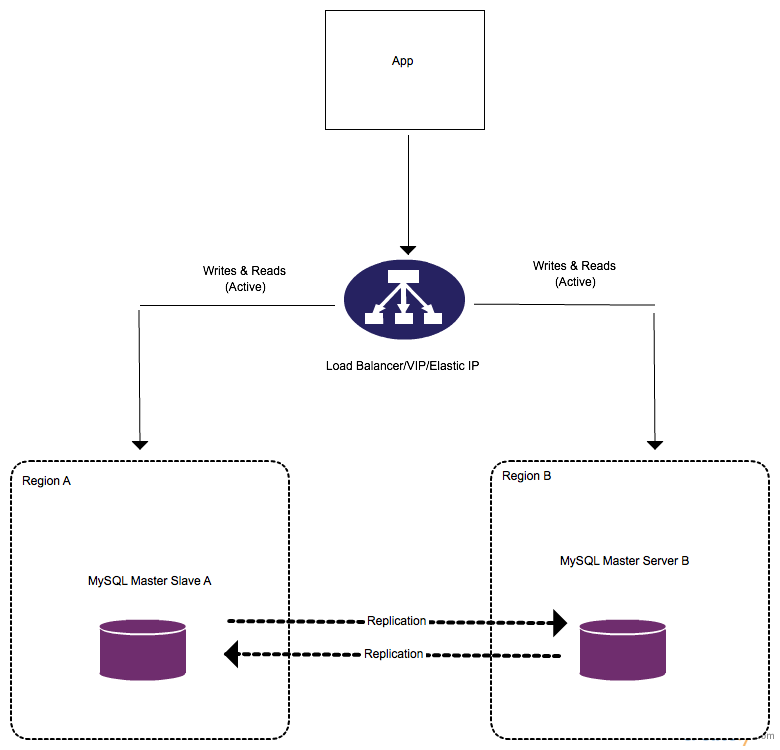

李铭：MySQL集群类型 + 分库分表操作实践 + pt-online-schema-change
================================================================

MySQL集群类型
-------------

Master-Slave(s)
~~~~~~~~~~~~~~~

.. image:: _static/master-slave.png 

在Master-Slave(s)架构中，Master负责写操作，Master和Slave负责读操作。Slave通过Replication与Master同步数据。

特点：

1. 读操作分摊给Slave，减少Master的压力。
#. 在Slave上进行整个数据库的备份对Master来说几乎无影响。
#. Slave即使下线了一段时间，也能通过Replication回到与Master同步的状态，然后继续服务。
#. 若Master宕机，需要下线Master，配置一台Slave为Master，并配置其他Slave与新Master进行Replication。在故障处理期间写操作将全部失败。

Master-Master(-Slaves)
~~~~~~~~~~~~~~~~~~~~~~

在Master-Master(-Slaves)架构中，有两个Master，并且是彼此的Slave。两个Master都能负责写操作和读操作，并且通过Replication同步对方的变化。另外，每个Master还可以额外再配置多几个Slave来分摊写操作的压力。

特点：

1. 两个Master分摊读、写操作的压力。若还配置额外的Slave，Slave也能分摊读操作的压力。
#. 很可能会发生操作冲突，例如两个Master更新了同一条数据。
#. 若其中一个Master宕机，只要先切掉到这台Master的流量即可，此时写操作能被另一台Master承担。

使用kingshard进行分库分表操作实践
----------------------------------

`kingshard <https://github.com/flike/kingshard>`_ 是一个go语言开发的高性能的MySQL代理，它能使读写分离和分库分表的操作透明化。现利用kingshard对分库分表进行操作实践。

创建数据库
~~~~~~~~~~~~

.. code-block:: sql
  
   master1: 192.168.199.113:3306
       CREATE DATABASE `kingshard`;
       CREATE TABLE `kingshard`.`test_shard_hash_0000` ( `id` INT NOT NULL , `name` VARCHAR(10) NOT NULL , PRIMARY KEY (`id`)) ENGINE = InnoDB;
       CREATE TABLE `kingshard`.`test_shard_hash_0001` ( `id` INT NOT NULL , `name` VARCHAR(10) NOT NULL , PRIMARY KEY (`id`)) ENGINE = InnoDB;
   
   master2: 192.168.199.243:3306
       CREATE DATABASE `kingshard`;
       CREATE TABLE `kingshard`.`test_shard_hash_0002` ( `id` INT NOT NULL , `name` VARCHAR(10) NOT NULL , PRIMARY KEY (`id`)) ENGINE = InnoDB;
       CREATE TABLE `kingshard`.`test_shard_hash_0003` ( `id` INT NOT NULL , `name` VARCHAR(10) NOT NULL , PRIMARY KEY (`id`)) ENGINE = InnoDB;

配置kingshard(etc/multi.yaml)
~~~~~~~~~~~~~~~~~~~~~~~~~~~~~~~
    
    方案：

    主键为id

    分片的类型为hash

    node1的master为192.168.199.113:3306，两个子表，没有salve

    node2的master为192.168.199.243:3306，两个子表，没有salve

.. code-block:: yaml 
   
    # server listen addr
    addr : 0.0.0.0:9696
    
    # server user and password
    user : root 
    password : root 
    
    log_path : /home/li/log/flike
    log_level : debug
    log_sql: on 
    
    # node is an agenda for real remote mysql server.
    nodes :
    - 
        name : node1 
    
        # default max conns for mysql server
        max_conns_limit : 8
    
        # all mysql in a node must have the same user and password
        user : root 
        password :root 
    
        # master represents a real mysql master server 
        master : 192.168.199.113:3306
    
        # slave represents a real mysql salve server,and the number after '@' is 
        # read load weight of this slave.
        #slave : 192.168.59.101:3307@2,192.168.59.101:3307@3
        down_after_noalive : 32
    - 
        name : node2 
    
        # default max conns for mysql server
        max_conns_limit : 8
    
        # all mysql in a node must have the same user and password
        user : root 
        password : root 
    
        # master represents a real mysql master server 
        master : 192.168.199.243:3306 
    
        # slave represents a real mysql salve server 
        slave : 
    
        # down mysql after N seconds noalive
        # 0 will no down
        down_after_noalive: 32
    
    # schema defines which db can be used by client and this db's sql will be executed in which nodes, the db is also the default database
    schema :
        db : kingshard
        nodes: [node1,node2]
        default: node1      
        shard:
        -   
            table: test_shard_hash
            key: id
            nodes: [node1, node2]
            type: hash
            locations: [2,2]

操作与日志
~~~~~~~~~~~
    
.. code-block:: sql

   operation:

   mysql> use kingshard;
   Database changed

   mysql> INSERT INTO `test_shard_hash` (`id`, `name`) VALUES ('1', '小明');
   Query OK, 1 row affected (0.02 sec)
   
   mysql> INSERT INTO `test_shard_hash` (`id`, `name`) VALUES ('2', '小红');
   Query OK, 1 row affected (0.12 sec)
   
   mysql> INSERT INTO `test_shard_hash` (`id`, `name`) VALUES ('3', '小白');
   Query OK, 1 row affected (0.02 sec)
   
   mysql> INSERT INTO `test_shard_hash` (`id`, `name`) VALUES ('4', '小黑');
   Query OK, 1 row affected (0.14 sec)
   
   mysql> INSERT INTO `test_shard_hash` (`id`, `name`) VALUES ('5', '小东');
   Query OK, 1 row affected (0.08 sec)
    
   mysql> INSERT INTO `test_shard_hash` (`id`, `name`) VALUES ('6', '小西');
   Query OK, 1 row affected (0.48 sec)
    
   mysql> INSERT INTO `test_shard_hash` (`id`, `name`) VALUES ('7', '小南');
   Query OK, 1 row affected (0.00 sec)
    
   mysql> INSERT INTO `test_shard_hash` (`id`, `name`) VALUES ('8', '小北');
   Query OK, 1 row affected (0.01 sec)

   mysql> UPDATE `test_shard_hash` SET `name` = '大白' WHERE `id` = 3;
   Query OK, 1 row affected (0.00 sec)

   mysql> DELETE FROM `test_shard_hash` WHERE `id` = 2;
   Query OK, 0 rows affected (0.00 sec)
   
   mysql> SELECT * FROM `test_shard_hash`;
   +----+--------+
   | id | name   |
   +----+--------+
   |  4 | 小黑   |
   |  6 | 小西   |
   |  2 | 小红   |
   |  5 | 小东   |
   |  7 | 小南   |
   |  1 | 小明   |
   |  3 | 大白   |
   |  8 | 小北   |
   +----+--------+
    8 rows in set (0.01 sec)

   log:

   2016/01/10 20:13:06 - OK - 18.7ms - 192.168.199.243:44224->192.168.199.243:3306:insert into test_shard_hash_0003(id, name) values ('1', '小明')
   2016/01/10 20:13:27 - OK - 90.1ms - 192.168.199.243:44224->192.168.199.113:3306:insert into test_shard_hash_0001(id, name) values ('2', '小红')
   2016/01/10 20:13:35 - OK - 23.5ms - 192.168.199.243:44224->192.168.199.243:3306:insert into test_shard_hash_0003(id, name) values ('3', '小白')
   2016/01/10 20:13:44 - OK - 69.7ms - 192.168.199.243:44224->192.168.199.113:3306:insert into test_shard_hash_0000(id, name) values ('4', '小黑')
   2016/01/10 20:16:39 - OK - 78.9ms - 192.168.199.243:44224->192.168.199.243:3306:insert into test_shard_hash_0002(id, name) values ('5', '小东')
   2016/01/10 20:16:49 - OK - 47.5ms - 192.168.199.243:44224->192.168.199.113:3306:insert into test_shard_hash_0000(id, name) values ('6', '小西')
   2016/01/10 20:16:55 - OK - 1.9ms  - 192.168.199.243:44224->192.168.199.243:3306:insert into test_shard_hash_0002(id, name) values ('7', '小南')
   2016/01/10 20:17:04 - OK - 4.5ms  - 192.168.199.243:44224->192.168.199.243:3306:insert into test_shard_hash_0003(id, name) values ('8', '小北')
   2016/01/10 20:25:26 - OK - 1.8ms  - 192.168.199.243:44224->192.168.199.243:3306:update test_shard_hash_0003 set name = '大白' where id = 3
   2016/01/10 20:27:51 - OK - 0.3ms  - 192.168.199.243:44224->192.168.199.243:3306:delete from test_shard_hash_0002 where id = 2
   2016/01/10 20:28:59 - OK - 0.3ms - 192.168.199.243:44224->192.168.199.243:3306:select * from test_shard_hash_0002
   2016/01/10 20:28:59 - OK - 0.2ms - 192.168.199.243:44224->192.168.199.243:3306:select * from test_shard_hash_0003
   2016/01/10 20:28:59 - OK - 3.9ms - 192.168.199.243:44224->192.168.199.113:3306:select * from test_shard_hash_0000
   2016/01/10 20:28:59 - OK - 2.7ms - 192.168.199.243:44224->192.168.199.113:3306:select * from test_shard_hash_0001

通过实验可以看出，kindshard能隐藏分库分表的细节，自动根据id将操作散列到对应的node上，使编程人员能够专心业务逻辑，而不用管分库分表的细节。

kindshard的特点
~~~~~~~~~~~~~~~~

1. 读写分离。
2. 跨节点分表。
3. 支持透明的MySQL连接池，不必每次新建连接。
4. 支持客户端IP访问控制。
5. 平滑上线DB或下线DB，前端应用无感知。
6. 支持多个slave，slave之间通过权值进行负载均衡。
7. 支持强制读主库。
8. 支持将sql发送到特定的node。
9. 支持在单个node上执行事务，不支持跨多个node执行事务。
10. 支持跨node的count,sum,max和min等函数。
11. 支持单个分表的join操作，即支持分表和另一张不分表的join操作。
12. 支持order by,limit等操作。
13. 支持主流语言（java,php,python,C/C++,Go)SDK的mysql的prepare特性。
14. 支持到后端DB的最大连接数限制。
15. 支持SQL日志及慢日志输出。

pt-online-schema-change ------------------------ `pt-online-schema-change <https://www.percona.com/doc/percona-toolkit/2.2/pt-online-schema-change.htmlhttps://www.percona.com/doc/percona-toolkit/2.2/pt-online-schema-change.html>`_ 是 Percona Toolkit 中的一个工具，它能在不阻塞读、写操作的情况下修改表结构。

创建表
~~~~~~

.. code-block:: sql

   CREATE TABLE `test`.`student` ( 
       `id` INT NOT NULL AUTO_INCREMENT ,  
       `name` VARCHAR(10) NOT NULL ,  
       `age` INT NOT NULL ,    
       PRIMARY KEY  (`id`)
   ) ENGINE = InnoDB CHARACTER SET utf8 COLLATE utf8_bin

插入一些数据
~~~~~~~~~~~~~

.. code-block:: sql

   INSERT INTO `test`.`student` (`id`, `name`, `age`) VALUES 
   (NULL, '小红', '12'), 
   (NULL, '小黑', '11'), 
   (NULL, '小白', '13'), 
   (NULL, '大黄', '23'), 
   (NULL, '大白', '100')

使用pt-online-schema-change修改表结构
~~~~~~~~~~~~~~~~~~~~~~~~~~~~~~~~~~~~~~

.. code-block:: sh 

   pt-online-schema-change --alter "ADD COLUMN address VARCHAR(100)" D=test,t=student,u=root,p=root --execute 
   
   No slaves found.  See --recursion-method if host li has slaves.
   Not checking slave lag because no slaves were found and --check-slave-lag was not specified.
   Operation, tries, wait:
      analyze_table, 10, 1
      copy_rows, 10, 0.25
      create_triggers, 10, 1
      drop_triggers, 10, 1
      swap_tables, 10, 1
      update_foreign_keys, 10, 1
   Altering `test`.`student`...
   Creating new table...
   Created new table test._student_new OK.
   Altering new table...
   Altered `test`.`_student_new` OK.

从 binlog 获取相关操作记录
~~~~~~~~~~~~~~~~~~~~~~~~~~~~

.. code-block:: sql

   CREATE TABLE `test`.`_student_new` (  
       `id` int(11) NOT NULL AUTO_INCREMENT,  
       `name` varchar(10) COLLATE utf8_bin NOT NULL,  
       `age` int(11) NOT NULL,  
       PRIMARY KEY (`id`)
   ) ENGINE=InnoDB AUTO_INCREMENT=6 DEFAULT CHARSET=utf8 COLLATE=utf8_bin
   ALTER TABLE `test`.`_student_new` ADD COLUMN address VARCHAR(100)
   CREATE DEFINER=`root`@`localhost` TRIGGER `pt_osc_test_student_del` AFTER DELETE ON `test`.`student` FOR EACH ROW DELETE IGNORE FROM `test`.`_student_new` WHERE `test`.`_student_new`.`id` <=> OLD.`id`
   CREATE DEFINER=`root`@`localhost` TRIGGER `pt_osc_test_student_upd` AFTER UPDATE ON `test`.`student` FOR EACH ROW REPLACE INTO `test`.`_student_new` (`id`, `name`, `age`) VALUES (NEW.`id`, NEW.`name`, NEW.`age`)
   CREATE DEFINER=`root`@`localhost` TRIGGER `pt_osc_test_student_ins` AFTER INSERT ON `test`.`student` FOR EACH ROW REPLACE INTO `test`.`_student_new` (`id`, `name`, `age`) VALUES (NEW.`id`, NEW.`name`, NEW.`age`)
   INSERT LOW_PRIORITY IGNORE INTO `test`.`_student_new` (`id`, `name`, `age`) SELECT `id`, `name`, `age` FROM `test`.`student` LOCK IN SHARE MODE /*pt-online-schema-change 6965 copy table*/
   ANALYZE TABLE `test`.`_student_new` /* pt-online-schema-change */
   RENAME TABLE `test`.`student` TO `test`.`_student_old`, `test`.`_student_new` TO `test`.`student`
   DROP TRIGGER IF EXISTS `test`.`pt_osc_test_student_del`
   DROP TRIGGER IF EXISTS `test`.`pt_osc_test_student_upd`
   DROP TRIGGER IF EXISTS `test`.`pt_osc_test_student_ins`
   DROP TABLE IF EXISTS `_student_old` /* generated by server */

pt-online-schema-change的工作原理
~~~~~~~~~~~~~~~~~~~~~~~~~~~~~~~~~~~

    1. 创建一张与被修改的表结构一样的表
    #. 修改新表的表结构
    #. 在旧表创建删除、更新、插入三个触发器来让接下来复制过程中发生的操作也反应到新表
    #. 通过`LOCK IN SHARE MODE`在旧表所读取的行加读锁，将旧表的数据复制到新表
    #. 重命名旧表和新表
    #. 删除第3步创建的触发器
    #. 删除旧表

注意事项
~~~~~~~~~~

    1. 在第4步中对所读的行加了读锁，这对数据库的正常写入还是有一定的影响的。可以通过--chunk-time配置每阶段复制的时长，或通过--chunk-size配置每阶段最多复制的行数^
    #. 若被修改结构的表是其他表的外键所引用的表，需要使用--alter-foreign-keys-method来自动修改其他表的外键引用新表
    #. 目前只有使用InnoD引擎的表才能使用该工具修改表结构

不同使用场景下的方案选型
------------------------

+--------------+-------------+------+------+----------+--------------+----------------+-------------------+
| 使用场景     | CPU         | 内存 | 硬盘 | 文件系统 | I/O 调度算法 | 存储引擎       | 分布式方案        |
+==============+=============+======+======+==========+==============+================+===================+
| Web应用      | 多核高速CPU |      |      |          |              | InnoDB         | 一主多从/双主互备 |
+--------------+-------------+------+------+----------+--------------+----------------+-------------------+
| 日志记录系统 | 多核高速CPU |      |      |          |              | MyISAM/Archive | 一主多从          |
+--------------+-------------+------+------+----------+--------------+----------------+-------------------+

参考资料
--------

    -- 《高性能MySQL》

    -- http://weibo.com/p/1001643874615465508614

    -- http://skillachie.com/2014/07/25/mysql-high-availability-architectures/#MySQL_Cluster

    -- http://erlycoder.com/43/mysql-master-slave-and-master-master-replication-step-by-step-configuration-instructions-

    -- https://www.percona.com/doc/percona-toolkit/2.2/pt-online-schema-change.html 

    -- https://github.com/flike/kingshard
